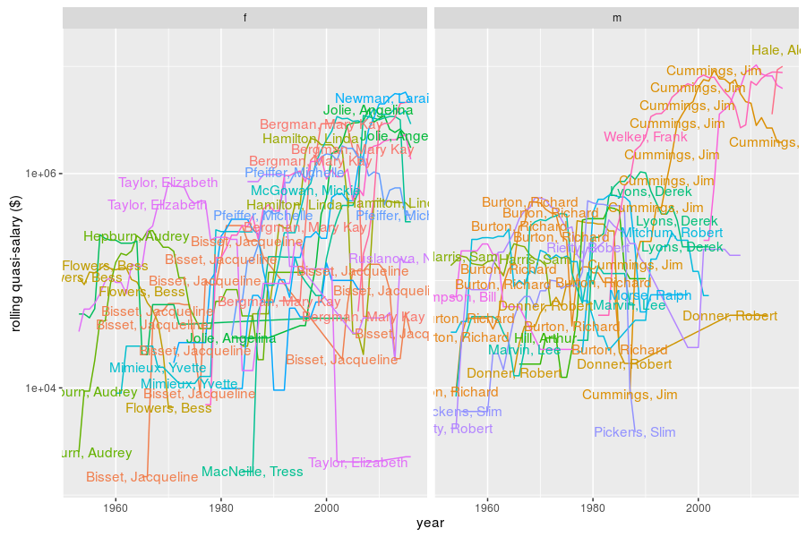

** WARNING **  something is currently broken with the docker setup, likely
caused by changes in the `mariadb` container...


# IMDb Mirror

This is a 'mirror' of the IMDb database, stored in a mariadb
database. The data are downloaded from one of the IMDb FTP
mirrors, then processed to remove TV shows, porn, shorts, 
and 'insignificant' films (based on number of ratings).
The database and scraper are housed in `docker` containers
and orchestrated via `docker-compose` 

## Initialization

Prepare the `srv` directory where we will store the database
and the make state:


```bash
mkdir -p ./srv/imdb/mariadb ./srv/imdb/state/make ./srv/imdb/rw 
chmod -R 777 ./srv/imdb
```

Then use `docker-compose` to initialize the database.


```bash
docker-compose build
docker-compose up -d
sleep 2s && docker-compose ps
```

It may take a while to pull the image for `mariadb`. To check on the status
of your images, run


```bash
docker-compose ps
```

You should see something like the following:
```
         Name                       Command              State             Ports          
-----------------------------------------------------------------------------------------
imdbmirror_imdb_1         /usr/bin/make noop             Exit 0                           
imdbmirror_mariastate_1   /bin/true                      Exit 0                           
imdbmirror_mysqldb_1      /docker-entrypoint.sh mysqld   Up       0.0.0.0:23306->3306/tcp 
imdbmirror_state_1        /bin/true                      Exit 0                           
```

## Download

The commands to download, transform, and store the IMDb data are
run via a `Makefile` within the `docker` image `imdb`. The main command
of this `docker` image is `make`, so y
be run via:


```bash
alias imake='docker-compose run --rm imdb'
imake help
```

Creating a mirror works by the following steps:

1. Downloading files from the FTP mirror.
1. Processing them with perl to remove TV shows.
1. Stuffing them into a sqlite file with `imdb2sql.py`.
1. Removing porn, unpopular titles and shorts, as well as stranded actors and
	 directors.
1. Stuffing the remaining data into mariadb, interpreting some of the fields.

You can run them via:


```bash
# download:
imake -j 4 downloaded
# process 
imake -j 6 procd
# raw sqlite
imake raw_sqlite
# remove porn and so on:
imake sqlite
# stuff into mariadb:
imake stuffed
```

**Note** This can take a good long while. Depending on your internet connection, the 
download might take 20 minutes or more. Processing into sqlite may take around 10 to 
15 minutes, and then post-processing and loading into mariadb may take an hour. Also,
intermediate files will be kept around, saved in the `./srv/imdb/state` directory.
Having intermediate files allows you to change the code and rerun without forcing a
new download.

Now connect to the database and poke around:


```bash
mysql -s --host=0.0.0.0 --port=23306 --user=moe --password=movies4me IMDB
```

## Shiny frontend

The `docker-compose` command now also supports a shiny database front end. If you wish to 
turn it off, comment out the following stanza from `docker-compose.yml` (I do not know
of a better solution at the moment):


```bash
# comment it out by putting '#' in front, like a nice yaml file.
shiny:
  extends:
    file: common.yml
    service: common
  build: ./shiny
  links: 
  - mysqldb:mysqldb
  ports:
  - 0.0.0.0:19191:5555
```

If you _do_ want to use the shiny frontend, once the image is running, go to
[localhost port 19191](http://localhost:19191), and poke around. You can
grep for title, cast members, directors, restrict by votes per year and
production year. When you select a row from the table in the `titles` tab,
details on that film will become available in the other tabs.

---------------------

## What is in the database?

First, let us check the available tables:


```r
library(RMySQL)
library(dplyr)
library(knitr)
imcon <- src_mysql(host='0.0.0.0',user='moe',password='movies4me',dbname='IMDB',port=23306)
capt <- dbGetQuery(imcon$con,'SET NAMES utf8')
show(src_tbls(imcon))
```

```
##  [1] "aka_name"                  "aka_title"                 "cast_info"                
##  [4] "char_name"                 "company_name"              "company_type"             
##  [7] "info_type"                 "keyword"                   "movie_US_gross"           
## [10] "movie_admissions"          "movie_budgets"             "movie_companies"          
## [13] "movie_first_US_release"    "movie_gross"               "movie_info"               
## [16] "movie_info_idx"            "movie_keyword"             "movie_opening_weekend"    
## [19] "movie_premiere_US_release" "movie_raw_runtimes"        "movie_release_dates"      
## [22] "movie_rentals"             "movie_runtime"             "movie_votes"              
## [25] "movie_weekend_gross"       "name"                      "name_link"                
## [28] "person_info"               "role_type"                 "title"                    
## [31] "title_link"                "votes_per_year"
```

## Movie info

First, how many movies do we have:


```r
nmovies <- tbl(imcon,'title') %>%
	summarize(count=n()) 
print(nmovies)
```

```
## Source: mysql 5.5.5-10.1.13-MariaDB-1~jessie [moe@0.0.0.0:/IMDB]
## From: <derived table> [?? x 1]
## 
##     count
##     (dbl)
## 1  233061
## ..    ...
```

Now some information about each of the tables:


```r
library(RMySQL)
library(dplyr)
library(knitr)
imcon <- src_mysql(host='0.0.0.0',user='moe',password='movies4me',dbname='IMDB',port=23306)
capt <- dbGetQuery(imcon$con,'SET NAMES utf8')
showtable <- function(tnam) {
  cat(sprintf('\n\n### %8s:\n',tnam))
	tbl(imcon,tnam) %>%
		left_join(tbl(imcon,'title') %>% select(movie_id,title),by='movie_id') %>%
    head() %>%
    kable(caption=tnam) %>%
		show()
}

movie_tables <- src_tbls(imcon) 
movie_tables <- movie_tables[grepl('^movie_',movie_tables)]
capt <- lapply(movie_tables,showtable)
```


### movie_US_gross:


| movie_id| gross_dollars|last_report_date |title                                                   |
|--------:|-------------:|:----------------|:-------------------------------------------------------|
|      313|       5.2e+04|2010-01-17       |$9.99                                                   |
|      323|       9.3e+03|2016-05-19       |$pent                                                   |
|      362|       1.3e+06|2015-05-03       |'71                                                     |
|      412|       7.1e+06|2016-05-19       |'Breaker' Morant                                        |
|      447|       1.1e+08|2016-05-19       |'Crocodile' Dundee II                                   |
|      498|       2.2e+06|1943-12-31       |'Gung Ho!': The Story of Carlson's Makin Island Raiders |


### movie_admissions:


| movie_id| id| amount|locale |end_date   |title           |
|--------:|--:|------:|:------|:----------|:---------------|
|   249155|  1|   1225|FRANCE |2016-01-26 |Fanny           |
|   249155|  2|   1128|FRANCE |2016-01-19 |Fanny           |
|   532035|  3|  92169|SPAIN  |NA         |Nobleza baturra |
|   166918|  4|   1152|FRANCE |2016-01-26 |César           |
|   166918|  5|   1094|FRANCE |2016-01-19 |César           |
|   124437|  6|    727|FRANCE |2015-04-14 |Camille         |


### movie_budgets:


| movie_id| id|units | amount|title         |
|--------:|--:|:-----|------:|:-------------|
|        2|  1|$     |    500|#             |
|       15|  2|$     |    500|#2 Chick      |
|       25|  3|$     |   1000|#30           |
|       41|  4|€     |   1500|#99           |
|       44|  5|€     |  10000|#ambigot      |
|       55|  6|$     |  20000|#bars4Justice |


### movie_companies:


| movie_id| id| company_id| company_type_id|note                                |title                                     |
|--------:|--:|----------:|---------------:|:-----------------------------------|:-----------------------------------------|
|       25|  5|          4|               1|(2015) (USA) (video)                |#30                                       |
|       39|  7|          6|               1|(2007) (India) (all media)          |#73, Shaanthi Nivaasa                     |
|       70|  9|          8|               1|(2016) (Mexico) (theatrical)        |#BuscandoaInés                            |
|      115| 11|         10|               1|(2014) (USA) (all media) (Internet) |#Hacked                                   |
|      122| 12|         11|               1|(2015) (worldwide) (video)          |#HeroIsTheNewBlack!                       |
|      124| 13|         12|               1|(2013) (Russia) (all media)         |#Hommes: True Story of the Thieves' World |


### movie_first_US_release:


| movie_id|date       |title                           |
|--------:|:----------|:-------------------------------|
|        2|2014-01-20 |#                               |
|        6|2015-12-12 |#1 at the Apocalypse Box Office |
|        7|2014-04-30 |#1 Beauty Nail Salon            |
|       11|2015-12-01 |#10007                          |
|       12|2015-07-30 |#1137                           |
|       15|2014-06-17 |#2 Chick                        |


### movie_gross:


| movie_id| id|units |  amount|locale    | reissue|end_date   |title                          |
|--------:|--:|:-----|-------:|:---------|-------:|:----------|:------------------------------|
|   800610|  1|ITL   | 2.4e+08|ITALY     |       0|NA         |The Silent Enemy               |
|    44754|  2|$     | 3.3e+06|USA       |       0|NA         |All Quiet on the Western Front |
|    58263|  3|$     | 1.0e+06|USA       |       0|NA         |Anna Christie                  |
|    58263|  4|$     | 4.9e+05|WORLDWIDE |       0|NA         |Anna Christie                  |
|   185421|  5|$     | 7.8e+04|USA       |       0|2001-12-09 |Der blaue Engel                |
|   185421|  6|$     | 6.9e+04|USA       |       0|2001-11-11 |Der blaue Engel                |


### movie_info:


| movie_id|     id| info_type_id|info                                                                                                                                                                                                                                                             |note |title |
|--------:|------:|------------:|:----------------------------------------------------------------------------------------------------------------------------------------------------------------------------------------------------------------------------------------------------------------|:----|:-----|
|      269| 370439|           15|Dawn Divine: He could have killed me too, you know?::Joe Collins: That's right.::Dawn Divine: I hate him!::Joe Collins: Waste of time!::Dawn Divine: I don't care! I could kill him!::Joe Collins: Hey, stealing's a business, not a crusade.                    |NA   |$     |
|      269| 370440|           15|Granich: Can you gets these bottles into Copenhagan?::Candy Man: What is it?::Granich: Pure, consentrated, acid. From one ounce, they will make 300,000 capsules of LSD. If you put one of these into the water supply, all of Hamburg takes the trip!           |NA   |$     |
|      269| 370441|           15|[on the telephone]::Sarge: Yeah, I know the line is busy. Find out if Miss Divine is talking, or if the phone is out of order. Hello? Operator? [hangs up] Damn, Hamburg operators. Why the hell don't they learn English?                                       |NA   |$     |
|      269| 370442|           15|Sarge: [in an irritable voice as he disgustedly watches the Candy Man lean back and forth and crane his neck in various directions and climb around to look on different sides of the closet walls and tap the panelling with his knuckles] What're ya BUILDIN'? |NA   |$     |
|      269| 370443|           15|Mr. Kessel: [seeing Miss Devine's heavily-loaded grocery bag] Ahhhh, Fraulein! Soooo much to eat for such a little girl::Dawn Divine: [giggling] I have no willpower!                                                                                            |NA   |$     |
|      269| 370444|           15|Sarge: [seeing that Miss Devine is exiting the booth that he was planning to go into] Hey - - what're you doing in there?::Dawn Divine: [flashing a bright mischievous smile and replying in a pretend furtive whisper] Robbing a bank!                          |NA   |$     |


### movie_info_idx:


| movie_id|     id| info_type_id|info       |note |title                 |
|--------:|------:|------------:|:----------|:----|:---------------------|
|       39| 881598|           99|1000001103 |NA   |#73, Shaanthi Nivaasa |
|       39| 881599|          100|117        |NA   |#73, Shaanthi Nivaasa |
|       39| 881600|          101|6.4        |NA   |#73, Shaanthi Nivaasa |
|       41| 881607|           99|0.......08 |NA   |#99                   |
|       41| 881608|          100|13         |NA   |#99                   |
|       41| 881609|          101|9.2        |NA   |#99                   |


### movie_keyword:


| movie_id|  id| keyword_id|title                             |
|--------:|---:|----------:|:---------------------------------|
|       62| 115|        111|#Bitch, les filles et la violence |
|       62| 116|        112|#Bitch, les filles et la violence |
|       62| 117|        113|#Bitch, les filles et la violence |
|       62| 118|        114|#Bitch, les filles et la violence |
|       62| 119|        115|#Bitch, les filles et la violence |
|       75| 120|        116|#Coachella                        |


### movie_opening_weekend:


| movie_id| id|units | amount|locale | screens|end_date   |title              |
|--------:|--:|:-----|------:|:------|-------:|:----------|:------------------|
|   185421|  1|$     |   4808|USA    |       1|2001-07-22 |Der blaue Engel    |
|   185421|  2|$     |   6451|USA    |       1|2001-07-15 |Der blaue Engel    |
|   405541|  3|£     |   1901|UK     |       1|2004-02-15 |L'âge d'or         |
|   464463|  4|$     |   6123|USA    |       1|1931-03-14 |M                  |
|   488326|  5|$     |   7554|USA    |       1|2015-08-09 |Metropolitan       |
|   411775|  6|$     |   7526|USA    |       1|2012-05-13 |La grande illusion |


### movie_premiere_US_release:


| movie_id|date       |title         |
|--------:|:----------|:-------------|
|       55|2015-10-01 |#bars4Justice |
|      244|2016-01-24 |#UnitedWeWin. |
|      251|2016-12-31 |#WeFilmLA     |
|      269|1971-12-15 |$             |
|      336|2008-10-09 |& Teller      |
|      489|1935-04-18 |'G' Men       |


### movie_raw_runtimes:


| movie_id| rt|title                           |
|--------:|--:|:-------------------------------|
|        7|  5|#1 Beauty Nail Salon            |
|        6| 11|#1 at the Apocalypse Box Office |
|       11| 10|#10007                          |
|       18|  7|#23                             |
|       25|  6|#30                             |
|       28| 11|#47                             |


### movie_release_dates:


| movie_id| id|locale    |date       | is_premiere|note           |title                           |
|--------:|--:|:---------|:----------|-----------:|:--------------|:-------------------------------|
|        2|  1|USA       |2014-01-20 |           0|(DVD premiere) |#                               |
|        7|  2|USA       |2014-04-30 |           0|NA             |#1 Beauty Nail Salon            |
|        6|  3|AUSTRALIA |2015-07-31 |           0|NA             |#1 at the Apocalypse Box Office |
|        6|  4|USA       |2015-12-12 |           0|NA             |#1 at the Apocalypse Box Office |
|       11|  5|USA       |2015-12-01 |           0|NA             |#10007                          |
|       12|  6|USA       |2015-07-30 |           0|NA             |#1137                           |


### movie_rentals:


| movie_id| id|units |  amount|locale    | estimated| ex_usa|title                          |
|--------:|--:|:-----|-------:|:---------|---------:|------:|:------------------------------|
|    44754|  1|$     | 1500000|USA       |         0|      0|All Quiet on the Western Front |
|   745215|  2|$     | 1218000|WORLDWIDE |         0|      0|The Divorcee                   |
|   348571|  3|$     |  551000|USA       |         0|      0|In Gay Madrid                  |
|   348571|  4|$     |  398000|NON-USA   |         0|      0|In Gay Madrid                  |
|   892605|  5|$     | 2300000|WORLDWIDE |         0|      0|Whoopee!                       |
|   145575|  6|$     | 1500000|USA       |         0|      0|City Lights                    |


### movie_runtime:


| movie_id| runtime| minruntime| maxruntime| nruntimes|title                           |
|--------:|-------:|----------:|----------:|---------:|:-------------------------------|
|        6|      11|         11|         11|         1|#1 at the Apocalypse Box Office |
|        7|       5|          5|          5|         1|#1 Beauty Nail Salon            |
|       11|      10|         10|         10|         1|#10007                          |
|       18|       7|          7|          7|         1|#23                             |
|       25|       6|          6|          6|         1|#30                             |
|       28|      11|         11|         11|         1|#47                             |


### movie_votes:


| movie_id| id|updated_at          | votes| rating| vote_mean| vote_sd| vote_se| vote1| vote2| vote3| vote4| vote5| vote6| vote7| vote8| vote9| vote10|title                 |
|--------:|--:|:-------------------|-----:|------:|---------:|-------:|-------:|-----:|-----:|-----:|-----:|-----:|-----:|-----:|-----:|-----:|------:|:---------------------|
|       39|  1|2016-05-17 13:19:07 |   117|    6.4|       6.7|     3.2|    0.30|    14|     5|     5|     5|     5|     5|    14|    14|     5|     32|#73, Shaanthi Nivaasa |
|       41|  2|2016-05-17 13:19:07 |    13|    9.2|       9.5|     2.0|    0.56|     5|     0|     0|     0|     0|     0|     0|     0|     5|     89|#99                   |
|       45|  3|2016-05-17 13:19:07 |    17|    7.0|       7.1|     2.3|    0.56|     5|     0|     0|    14|     5|     0|    24|    24|    14|     14|#AmeriCan             |
|       57|  4|2016-05-17 13:19:07 |     9|    4.9|       5.0|     3.1|    1.05|    30|     0|    13|     0|     0|     0|    30|    13|    13|      0|#Beings               |
|      120|  5|2016-05-17 13:19:07 |     6|    8.2|       8.3|     3.2|    1.32|    16|     0|     0|     0|     0|     0|     0|    16|     0|     68|#Help                 |
|      125|  6|2016-05-17 13:19:07 |  1198|    3.4|       3.9|     2.7|    0.08|    25|    15|    15|    15|     5|     5|     5|     5|     5|      5|#Horror               |


### movie_weekend_gross:


| movie_id| id|units | amount|locale | screens|end_date   | days_open|title           |
|--------:|--:|:-----|------:|:------|-------:|:----------|---------:|:---------------|
|   185421|  1|$     |   7806|USA    |       1|2001-12-09 |       147|Der blaue Engel |
|   185421|  2|$     |   1854|USA    |       1|2001-11-11 |       119|Der blaue Engel |
|   185421|  3|$     |   8134|USA    |       1|2001-11-04 |       112|Der blaue Engel |
|   185421|  4|$     |   3430|USA    |       1|2001-08-12 |        28|Der blaue Engel |
|   185421|  5|$     |   4808|USA    |       1|2001-07-22 |         7|Der blaue Engel |
|   185421|  6|$     |   6451|USA    |       1|2001-07-15 |         0|Der blaue Engel |

-------------

## Cast by budget

Here we grab all movies with budget information (_n.b._ these are sometimes
bogus, because IMDb users can enter the information without much confirmation.)
then sum movie budgets for each actor and actress appearing in the movie,
then find the top actor and actress by birth year. Here we list the top
actor and actress by birth year, with total budget in billions, and the number
of films:


```r
library(RMySQL)
library(dplyr)
library(knitr)
imcon <- src_mysql(host='0.0.0.0',user='moe',password='movies4me',dbname='IMDB',port=23306)
capt <- dbGetQuery(imcon$con,'SET NAMES utf8')

# values over 300M are likely bogus
budgets <- tbl(imcon,'movie_budgets') %>%
	filter(units=='$') %>%
	select(movie_id,amount) %>%
	filter(amount < 3e8)

role_info <- tbl(imcon,'role_type') %>%
	filter(role %in% c('actor','actress')) %>%
	select(role_id)

sumbudget <- tbl(imcon,'cast_info') %>%
	inner_join(role_info,by='role_id') %>%
  select(movie_id,person_id,role_id) %>%
	inner_join(budgets,by='movie_id') %>%
	group_by(person_id) %>% 
	summarize(totroles=n(),
    sumamount=sum(amount)) %>%
  ungroup()

aggregated <- sumbudget %>%
	inner_join(tbl(imcon,'name') %>%
		select(person_id,name,dob,gender) %>%
    filter(!is.null(dob)),by='person_id') %>%
  collect() 

topcast <- aggregated %>%
	mutate(yob=as.numeric(gsub('^((19|20)\\d{2}).+','\\1',dob))) %>%
	filter(!is.na(yob)) %>%
  group_by(yob,gender) %>%
  arrange(desc(sumamount)) %>%
  summarize(totbudget=first(sumamount) / 1e9,
    topname=first(name),
    toproles=first(totroles)) %>%
  ungroup()


# I wish there were an easy way to do this via tidyr,
# and maybe there is...
topm <- topcast %>% 
  select(yob,topname,toproles,totbudget,gender) %>% 
	filter(gender=='m')
topf <- topcast %>% 
  select(yob,topname,toproles,totbudget,gender) %>% 
	filter(gender=='f')

topc <- inner_join(topm %>% select(-gender),topf %>% select(-gender),by='yob') %>%
	rename(actor_total_budget=totbudget.x,
    actor_name=topname.x,
    actor_roles=toproles.x,
    actress_total_budget=totbudget.y,
    actress_name=topname.y,
    actress_roles=toproles.y)

topc %>% 
	filter(yob > 1945,yob <= 1995) %>%
  kable()
```


|  yob|actor_name            | actor_roles| actor_total_budget|actress_name        | actress_roles| actress_total_budget|
|----:|:---------------------|-----------:|------------------:|:-------------------|-------------:|--------------------:|
| 1946|Welker, Frank         |         137|               8.27|Sarandon, Susan     |            52|                 1.63|
| 1947|Ratzenberger, John    |          35|               2.88|Marshall, Mona      |            28|                 2.34|
| 1948|Jackson, Samuel L.    |          88|               4.80|Bates, Kathy        |            37|                 1.70|
| 1949|Broadbent, Jim        |          42|               2.48|Weaver, Sigourney   |            43|                 1.76|
| 1950|Coltrane, Robbie      |          25|               2.06|Walters, Julie      |            16|                 1.31|
| 1951|Williams, Robin       |          58|               2.56|MacNeille, Tress    |            35|                 1.82|
| 1952|Neeson, Liam          |          63|               3.66|Newman, Laraine     |            32|                 2.77|
| 1953|Molina, Alfred        |          35|               1.90|Lockhart, Anne      |            29|                 1.28|
| 1954|Rabson, Jan           |          32|               2.47|Russo, Rene         |            20|                 1.16|
| 1955|Willis, Bruce         |          76|               3.41|Goldberg, Whoopi    |            45|                 1.38|
| 1956|Hanks, Tom            |          53|               3.59|Staunton, Imelda    |            20|                 1.20|
| 1957|Castellaneta, Dan     |          38|               2.37|Hoffman, Bridget    |            30|                 1.83|
| 1958|Oldman, Gary          |          42|               3.20|Pfeiffer, Michelle  |            32|                 1.29|
| 1959|Morshower, Glenn      |          39|               1.97|Thompson, Emma      |            27|                 1.66|
| 1960|Weaving, Hugo         |          32|               3.30|Moore, Julianne     |            51|                 1.64|
| 1961|Murphy, Eddie         |          58|               3.38|Hunt, Bonnie        |            20|                 1.52|
| 1962|Baker, Dee Bradley    |          58|               3.37|Cusack, Joan        |            28|                 1.31|
| 1963|Harnell, Jess         |          42|               4.39|Shue, Elisabeth     |            24|                 0.59|
| 1964|Papajohn, Michael     |          52|               3.88|Janssen, Famke      |            31|                 1.51|
| 1965|Downey Jr., Robert    |          53|               3.50|Lane, Diane         |            25|                 1.39|
| 1966|Favreau, Jon          |          30|               2.15|Berry, Halle        |            36|                 2.60|
| 1967|Ruffalo, Mark         |          38|               2.24|Kidman, Nicole      |            38|                 1.95|
| 1968|Vernon, Conrad        |          26|               3.75|Liu, Lucy           |            26|                 1.29|
| 1969|Black, Jack           |          47|               2.58|Blanchett, Cate     |            33|                 2.48|
| 1970|Damon, Matt           |          57|               2.97|Weisz, Rachel       |            23|                 1.48|
| 1971|Renner, Jeremy        |          27|               2.59|Gugino, Carla       |            30|                 1.81|
| 1972|Johnson, Dwayne       |          33|               1.91|Diaz, Cameron       |            35|                 1.90|
| 1973|Marsden, James        |          37|               2.08|Wiig, Kristen       |            22|                 1.28|
| 1974|Bale, Christian       |          33|               1.93|Banks, Elizabeth    |            33|                 1.80|
| 1975|Maguire, Tobey        |          21|               1.81|Jolie, Angelina     |            34|                 2.32|
| 1976|Cumberbatch, Benedict |          19|               1.79|Witherspoon, Reese  |            29|                 1.21|
| 1977|Bloom, Orlando        |          17|               1.71|Washington, Kerry   |            20|                 0.86|
| 1978|Mackie, Anthony       |          37|               2.64|Saldana, Zoe        |            25|                 1.32|
| 1979|Evans, Luke           |          12|               1.62|Dawson, Rosario     |            33|                 1.25|
| 1980|Tatum, Channing       |          31|               1.58|Green, Eva          |             9|                 0.96|
| 1981|Evans, Chris          |          29|               3.20|Portman, Natalie    |            33|                 1.51|
| 1982|Rogen, Seth           |          34|               1.84|Dunst, Kirsten      |            36|                 1.44|
| 1983|Hemsworth, Chris      |          18|               2.03|Kunis, Mila         |            21|                 1.11|
| 1984|Curry, Graham         |          16|               1.71|Johansson, Scarlett |            39|                 3.26|
| 1985|Lutz, Kellan          |          14|               0.70|Gadot, Gal          |            10|                 1.29|
| 1986|LaBeouf, Shia         |          20|               1.49|Fox, Megan          |            11|                 0.82|
| 1987|Felton, Tom           |          14|               1.28|Page, Ellen         |            12|                 0.82|
| 1988|Integra, Raiden       |          15|               1.56|Stone, Emma         |            16|                 0.94|
| 1989|Hoult, Nicholas       |          13|               1.31|Olsen, Elizabeth    |             7|                 1.36|
| 1990|Taylor-Johnson, Aaron |          14|               1.08|Lawrence, Jennifer  |            18|                 1.42|
| 1991|Keynes, Skandar       |           3|               0.56|Wright, Bonnie      |             7|                 1.03|
| 1992|Sabara, Daryl         |          19|               1.60|Watters, Bailee     |             8|                 0.81|
| 1993|Bright, Cameron       |          16|               0.80|Robb, AnnaSophia    |            11|                 0.42|
| 1994|Melling, William      |           5|               0.70|Fanning, Dakota     |            21|                 0.86|
| 1995|Jackson, Billy        |           6|               0.58|Hanratty, Sammi     |            14|                 0.87|

### Try again

That kind of works. However, the `cast_info` table also contains a field
`nr_order` that lists the _order_ of an actor/actress in some films. 
(In some titles, the `nr_order` field is not populated, or lists
each cast member as 1.) Presumably lower order equates to higher billing
in the cast and perhaps higher salary. Here we proceed to estimate
total earned salary for actors and actresses by assuming salary is inversely
proportional to the `nr_order`, as follows:

1. For each film, fill out any missing `nr_order` with the largest known
value for that film.
1. Then substitute all missing `nr_order` values with a 1 (this only
occurs for films with no recorded values for `nr_order`).
1. Rescale the `nr_order` for each film so that they sum to 1.0 for
each film.
1. Multiply the rescaled `nr_order` by one-seventh the budget of the film.
1. Aggregate over actors and actresses, then group by birth year and
gender.


```r
library(RMySQL)
library(dplyr)
library(knitr)
imcon <- src_mysql(host='0.0.0.0',user='moe',password='movies4me',dbname='IMDB',port=23306)
capt <- dbGetQuery(imcon$con,'SET NAMES utf8')

# values over 300M are likely bogus
budgets <- tbl(imcon,'movie_budgets') %>%
	filter(units=='$') %>%
	select(movie_id,amount) %>%
	filter(amount < 3e8)

role_info <- tbl(imcon,'role_type') %>%
	filter(role %in% c('actor','actress')) %>%
	select(role_id)

aggbudget <- tbl(imcon,'cast_info') %>%
	inner_join(role_info,by='role_id') %>%
	select(movie_id,person_id,role_id,nr_order) %>%
	inner_join(budgets,by='movie_id') %>%
	collect()

# fill with max
fix1 <- aggbudget %>%
	group_by(movie_id) %>%
	mutate(nr_order=pmin(nr_order,max(nr_order,na.rm=TRUE),na.rm=TRUE)) %>%
	ungroup()

# replace with 1
fix2 <- fix1 %>% 
	mutate(nr_order=pmin(nr_order,1,na.rm=TRUE)) 

# rescale
fix3 <- fix2 %>% 
	mutate(scale_order=1 / (nr_order)) %>%
	group_by(movie_id) %>%
	mutate(scale_order=scale_order / sum(scale_order,na.rm=FALSE)) %>%
  ungroup()

# multiply by budget, divide by 7, aggregate over people
bbyname <- fix3 %>% 
	mutate(salary=(1.0/7.0) * scale_order * amount) %>%
	group_by(person_id) %>%
	summarize(totsalary=sum(salary),
    totroles=n()) %>%
	ungroup()

# get name info
naminfo <- tbl(imcon,'name') %>%
	select(person_id,name,dob,gender) %>%
	filter(!is.null(dob)) %>%
	collect()

topcast <- bbyname %>% 
	inner_join(naminfo,by='person_id') %>%
	mutate(yob=as.numeric(gsub('^((19|20)\\d{2}).+','\\1',dob))) %>%
	filter(!is.na(yob)) %>%
  group_by(yob,gender) %>%
  arrange(desc(totsalary)) %>%
  summarize(totbudget=first(totsalary) / 1e6,
    topname=first(name),
    toproles=first(totroles)) %>%
  ungroup()


# I wish there were an easy way to do this via tidyr,
# and maybe there is...
topm <- topcast %>% 
  select(yob,topname,toproles,totbudget,gender) %>% 
	filter(gender=='m')
topf <- topcast %>% 
  select(yob,topname,toproles,totbudget,gender) %>% 
	filter(gender=='f')

topc <- inner_join(topm %>% select(-gender),topf %>% select(-gender),by='yob') %>%
	rename(actor_total_budget=totbudget.x,
    actor_name=topname.x,
    actor_roles=toproles.x,
    actress_total_budget=totbudget.y,
    actress_name=topname.y,
    actress_roles=toproles.y)

topc %>% 
	filter(yob > 1945,yob <= 1995) %>%
  kable()
```


|  yob|actor_name                | actor_roles| actor_total_budget|actress_name         | actress_roles| actress_total_budget|
|----:|:-------------------------|-----------:|------------------:|:--------------------|-------------:|--------------------:|
| 1946|Welker, Frank             |         137|              23.09|Darling, Jennifer    |            20|                 3.97|
| 1947|Ratzenberger, John        |          35|               8.68|Marshall, Mona       |            28|                 6.29|
| 1948|Jackson, Samuel L.        |          88|              10.23|Bates, Kathy         |            37|                 3.89|
| 1949|Broadbent, Jim            |          42|               5.56|Weaver, Sigourney    |            43|                 5.20|
| 1950|Perlman, Ron              |          49|               6.45|Walters, Julie       |            16|                 3.87|
| 1951|Williams, Robin           |          58|               6.21|MacNeille, Tress     |            35|                 4.08|
| 1952|Cummings, Jim             |          56|              14.40|Newman, Laraine      |            32|                 7.55|
| 1953|Molina, Alfred            |          35|               4.29|Soucie, Kath         |            30|                 4.39|
| 1954|Rabson, Jan               |          32|               6.68|O'Hara, Catherine    |            30|                 3.94|
| 1955|Willis, Bruce             |          76|               7.48|Goldberg, Whoopi     |            45|                 3.22|
| 1956|Hanks, Tom                |          53|               6.42|Staunton, Imelda     |            20|                 2.94|
| 1957|Buscemi, Steve            |          63|               5.56|Hoffman, Bridget     |            30|                 4.74|
| 1958|Oldman, Gary              |          42|               6.65|Pfeiffer, Michelle   |            32|                 3.78|
| 1959|Kilmer, Val               |          55|               5.60|Thompson, Emma       |            27|                 4.69|
| 1960|Banderas, Antonio         |          51|               6.70|Moore, Julianne      |            51|                 3.77|
| 1961|Murphy, Eddie             |          58|               7.78|Hunt, Bonnie         |            20|                 3.30|
| 1962|Baker, Dee Bradley        |          58|               7.48|Yeoh, Michelle       |            17|                 3.64|
| 1963|Harnell, Jess             |          42|              10.18|Shue, Elisabeth      |            24|                 2.11|
| 1964|Bergen, Bob               |          42|              10.25|Bullock, Sandra      |            32|                 4.84|
| 1965|Stiller, Ben              |          48|               5.90|Lane, Diane          |            25|                 2.52|
| 1966|Sturgis, Gary Anthony     |          19|              20.92|Berry, Halle         |            36|                 4.62|
| 1967|Statham, Jason            |          32|              25.44|Kidman, Nicole       |            38|                 4.50|
| 1968|Vernon, Conrad            |          26|              12.60|Liu, Lucy            |            26|                 3.90|
| 1969|Black, Jack               |          47|               6.54|Blanchett, Cate      |            33|                 5.42|
| 1970|Whiting, Al               |          12|              29.91|Weisz, Rachel        |            23|                 4.01|
| 1971|Stepanek, Brian           |          14|               5.85|Poehler, Amy         |            25|                 2.93|
| 1972|Law, Jude                 |          29|               4.74|Diaz, Cameron        |            35|                 3.80|
| 1973|McKidd, Kevin             |          17|               4.11|Wiig, Kristen        |            22|                 4.92|
| 1974|Ribisi, Giovanni          |          37|               3.56|Banks, Elizabeth     |            33|                 2.40|
| 1975|Sabongui, Patrick         |          21|               2.98|Jolie, Angelina      |            34|                 6.34|
| 1976|Reynolds, Ryan            |          26|               5.38|Witherspoon, Reese   |            29|                 2.66|
| 1977|Bloom, Orlando            |          17|               3.64|Wahlgren, Kari       |             9|                 2.64|
| 1978|Hader, Bill               |          31|               4.38|Mendez, Denny        |             4|                 3.25|
| 1979|Carew, John               |           1|               3.29|Hudson, Kate         |            25|                 2.68|
| 1980|Tatum, Channing           |          31|               2.86|Aguilera, Christina  |             5|                 2.71|
| 1981|Miller, T.J.              |          16|               4.86|Solomon, Christine   |             4|                 3.81|
| 1982|Rogen, Seth               |          34|               5.21|Dunst, Kirsten       |            36|                 2.57|
| 1983|Zelocchi, Enzo            |          10|              23.59|Ebanks, Selita       |             3|                 3.72|
| 1984|Curry, Graham             |          16|               2.17|Johansson, Scarlett  |            39|                 4.77|
| 1985|Duke, Clark               |          10|               2.84|Kendrick, Anna       |            22|                 2.57|
| 1986|LaBeouf, Shia             |          20|               2.52|Kanda, Sayaka        |             3|                 1.66|
| 1987|Felton, Tom               |          14|               2.53|Liu, Yifei           |             5|                 4.76|
| 1988|Integra, Raiden           |          15|               1.97|Stone, Emma          |            16|                 3.43|
| 1989|Mintz-Plasse, Christopher |          19|               4.82|Panettiere, Hayden   |            13|                 1.67|
| 1990|Jefferies, Marc John      |          16|               2.01|Stewart, Kristen     |            24|                 3.15|
| 1991|Keynes, Skandar           |           3|               1.39|Jackson, Amy         |             2|                 1.77|
| 1992|Hale, Alex                |           4|              45.86|Olszanska, Michalina |             3|                 3.88|
| 1993|Bright, Cameron           |          16|               1.66|Robb, AnnaSophia     |            11|                 0.99|
| 1994|Jones, Tyler Patrick      |           7|               1.59|Fanning, Dakota      |            21|                 2.53|
| 1995|Majors, Austin            |           6|               0.94|Hanratty, Sammi      |            14|                 1.44|

-------------

## Dominant actors over time

Let us consider this budget calculation another way: compute the pseudo-salary for each
actor and actress as a function of production year of the film, 
then compute a 9 year rolling mean for each actor and actress, and 
plot the dominant players over time.


```r
library(RMySQL)
library(dplyr)
library(knitr)
imcon <- src_mysql(host='0.0.0.0',user='moe',password='movies4me',dbname='IMDB',port=23306)
capt <- dbGetQuery(imcon$con,'SET NAMES utf8')

# values over 300M are likely bogus
budgets <- tbl(imcon,'movie_budgets') %>%
	filter(units=='$') %>%
	select(movie_id,amount) %>%
	filter(amount < 3e8)

role_info <- tbl(imcon,'role_type') %>%
	filter(role %in% c('actor','actress')) %>%
	select(role_id)

movie_yr <- tbl(imcon,'title') %>%
	select(movie_id,production_year) %>%
	rename(year=production_year) 

aggbudget <- tbl(imcon,'cast_info') %>%
	inner_join(role_info,by='role_id') %>%
	select(movie_id,person_id,role_id,nr_order) %>%
	inner_join(budgets,by='movie_id') %>%
  inner_join(movie_yr,by='movie_id') %>%
	collect()

# fill with max
fix1 <- aggbudget %>%
	group_by(movie_id) %>%
	mutate(nr_order=pmin(nr_order,max(nr_order,na.rm=TRUE),na.rm=TRUE)) %>%
	ungroup()

# replace with 1
fix2 <- fix1 %>% 
	mutate(nr_order=pmin(nr_order,1,na.rm=TRUE)) 

# rescale
fix3 <- fix2 %>% 
	mutate(scale_order=1 / (nr_order)) %>%
	group_by(movie_id) %>%
	mutate(scale_order=scale_order / sum(scale_order,na.rm=FALSE)) %>%
  ungroup()

# multiply by budget, divide by 7, aggregate over people, years, summing
bbynameyr <- fix3 %>% 
	mutate(salary=(1.0/7.0) * scale_order * amount) %>%
	group_by(person_id,year) %>%
	summarize(totsalary=sum(salary),
    totroles=n()) %>%
	ungroup()

# this is godawful slow and terrible: compute salary on a rolling window
pyrs <- 1945:2016
rollsum <- function(yrnum,tots,window=9) {
  yrv <- rep(0,length(pyrs))
	isin <- pyrs %in% yrnum
  yrv[isin] <- tots[yrnum %in% pyrs]
  cyrv <- cumsum(yrv)
  rv <- data.frame(yr=pyrs[window:length(pyrs)],dsum=diff(cyrv,lag=window-1))
  rv[rv$dsum > 0,]
}

aggbyyr <- bbynameyr %>%
  filter(totsalary > 1000) %>%
	arrange(year) %>%
	group_by(person_id) %>%
	do(rollsum(.$year,.$totsalary)) %>%
  ungroup() %>%
	filter(dsum > 0)
```

```r
Kval <- 1

# select anyone who has been in the top K in any year, by gender
topK <- aggbyyr %>% 
	inner_join(naminfo %>% select(person_id,gender),by='person_id') %>%
  arrange(desc(dsum)) %>%
	group_by(yr,gender) %>% 
  summarize(cutoff=nth(dsum,Kval)) %>%
  ungroup()

intopK <- aggbyyr %>% 
	inner_join(naminfo %>% select(person_id,gender),by='person_id') %>%
  inner_join(topK,by=c('yr','gender')) %>%
  filter(dsum >= cutoff) %>%
	distinct(person_id)

# now get the top 
topdogs <- aggbyyr %>%
	inner_join(naminfo %>% select(person_id,name,dob,gender),by='person_id') %>%
  inner_join(intopK %>% select(person_id),by='person_id')

topdogs %>% 
	group_by(yr,gender) %>%
	arrange(desc(dsum)) %>%
	summarize(tname=first(name)) %>%
  ungroup() %>%
  rename(name=tname) %>%
  kable()
```


|   yr|gender |name               |
|----:|:------|:------------------|
| 1953|f      |Flowers, Bess      |
| 1953|m      |Harris, Sam        |
| 1954|f      |Flowers, Bess      |
| 1954|m      |Harris, Sam        |
| 1955|f      |Flowers, Bess      |
| 1955|m      |Thompson, Bill     |
| 1956|f      |Flowers, Bess      |
| 1956|m      |Thompson, Bill     |
| 1957|f      |Kerr, Deborah      |
| 1957|m      |Mitchum, Robert    |
| 1958|f      |Kerr, Deborah      |
| 1958|m      |Mitchum, Robert    |
| 1959|f      |Kerr, Deborah      |
| 1959|m      |Mitchum, Robert    |
| 1960|f      |Kerr, Deborah      |
| 1960|m      |Mitchum, Robert    |
| 1961|f      |Kerr, Deborah      |
| 1961|m      |Mitchum, Robert    |
| 1962|f      |Kerr, Deborah      |
| 1962|m      |Mitchum, Robert    |
| 1963|f      |Kerr, Deborah      |
| 1963|m      |Mitchum, Robert    |
| 1964|f      |Hepburn, Audrey    |
| 1964|m      |Mitchum, Robert    |
| 1965|f      |Hepburn, Audrey    |
| 1965|m      |Rietty, Robert     |
| 1966|f      |Taylor, Elizabeth  |
| 1966|m      |Rietty, Robert     |
| 1967|f      |Taylor, Elizabeth  |
| 1967|m      |Rietty, Robert     |
| 1968|f      |Taylor, Elizabeth  |
| 1968|m      |Burton, Richard    |
| 1969|f      |Taylor, Elizabeth  |
| 1969|m      |Rietty, Robert     |
| 1970|f      |Taylor, Elizabeth  |
| 1970|m      |Rietty, Robert     |
| 1971|f      |Taylor, Elizabeth  |
| 1971|m      |Rietty, Robert     |
| 1972|f      |Taylor, Elizabeth  |
| 1972|m      |Rietty, Robert     |
| 1973|f      |Taylor, Elizabeth  |
| 1973|m      |Rietty, Robert     |
| 1974|f      |Taylor, Elizabeth  |
| 1974|m      |Marvin, Lee        |
| 1975|f      |Taylor, Elizabeth  |
| 1975|m      |Marvin, Lee        |
| 1976|f      |Taylor, Elizabeth  |
| 1976|m      |Rietty, Robert     |
| 1977|f      |Taylor, Elizabeth  |
| 1977|m      |Donner, Robert     |
| 1978|f      |Taylor, Elizabeth  |
| 1978|m      |Hill, Arthur       |
| 1979|f      |Mimieux, Yvette    |
| 1979|m      |Pickens, Slim      |
| 1980|f      |Mimieux, Yvette    |
| 1980|m      |Pickens, Slim      |
| 1981|f      |Bisset, Jacqueline |
| 1981|m      |Morse, Ralph       |
| 1982|f      |Perrine, Valerie   |
| 1982|m      |Morse, Ralph       |
| 1983|f      |Perrine, Valerie   |
| 1983|m      |Morse, Ralph       |
| 1984|f      |Perrine, Valerie   |
| 1984|m      |Lyons, Derek       |
| 1985|f      |Ruslanova, Nina    |
| 1985|m      |Lyons, Derek       |
| 1986|f      |Ruslanova, Nina    |
| 1986|m      |Lyons, Derek       |
| 1987|f      |Ruslanova, Nina    |
| 1987|m      |Lyons, Derek       |
| 1988|f      |Ruslanova, Nina    |
| 1988|m      |Welker, Frank      |
| 1989|f      |Ruslanova, Nina    |
| 1989|m      |Welker, Frank      |
| 1990|f      |Ruslanova, Nina    |
| 1990|m      |Welker, Frank      |
| 1991|f      |Ruslanova, Nina    |
| 1991|m      |Welker, Frank      |
| 1992|f      |Ruslanova, Nina    |
| 1992|m      |Welker, Frank      |
| 1993|f      |Weaver, Sigourney  |
| 1993|m      |Welker, Frank      |
| 1994|f      |Pfeiffer, Michelle |
| 1994|m      |Welker, Frank      |
| 1995|f      |Weaver, Sigourney  |
| 1995|m      |Welker, Frank      |
| 1996|f      |Hamilton, Linda    |
| 1996|m      |Welker, Frank      |
| 1997|f      |Hamilton, Linda    |
| 1997|m      |Welker, Frank      |
| 1998|f      |Hamilton, Linda    |
| 1998|m      |Welker, Frank      |
| 1999|f      |Bergman, Mary Kay  |
| 1999|m      |Welker, Frank      |
| 2000|f      |Bergman, Mary Kay  |
| 2000|m      |Welker, Frank      |
| 2001|f      |Bergman, Mary Kay  |
| 2001|m      |Welker, Frank      |
| 2002|f      |McGowan, Mickie    |
| 2002|m      |Welker, Frank      |
| 2003|f      |McGowan, Mickie    |
| 2003|m      |Cummings, Jim      |
| 2004|f      |McGowan, Mickie    |
| 2004|m      |Cummings, Jim      |
| 2005|f      |McGowan, Mickie    |
| 2005|m      |Cummings, Jim      |
| 2006|f      |McGowan, Mickie    |
| 2006|m      |Cummings, Jim      |
| 2007|f      |MacNeille, Tress   |
| 2007|m      |Cummings, Jim      |
| 2008|f      |Jolie, Angelina    |
| 2008|m      |Vernon, Conrad     |
| 2009|f      |McGowan, Mickie    |
| 2009|m      |Vernon, Conrad     |
| 2010|f      |Newman, Laraine    |
| 2010|m      |Vernon, Conrad     |
| 2011|f      |Newman, Laraine    |
| 2011|m      |Vernon, Conrad     |
| 2012|f      |Newman, Laraine    |
| 2012|m      |Vernon, Conrad     |
| 2013|f      |Newman, Laraine    |
| 2013|m      |Welker, Frank      |
| 2014|f      |Newman, Laraine    |
| 2014|m      |Welker, Frank      |
| 2015|f      |Newman, Laraine    |
| 2015|m      |Zelocchi, Enzo     |
| 2016|f      |Wiig, Kristen      |
| 2016|m      |Hale, Alex         |

```r
library(ggplot2)

ph <- ggplot(topdogs,aes(x=yr,y=dsum,group=name,color=name,label=name)) +
  geom_line() + 
  geom_text(check_overlap=TRUE) +
	labs(x='year',y='rolling quasi-salary ($)') +
  facet_grid(. ~ gender) + 
  scale_y_log10() + 
  guides(col=FALSE)

print(ph)
```




-------------

## Underrated movies

Here we use `dplyr` to connect to the database, and create a list of
the best 'underrated' movies of each year. The criteria are:

1. More than 500 ratings, but
1. fewer than 2000 ratings, and 
1. ranked via mean rating divided by standard deviation.


```r
library(RMySQL)
library(dplyr)
library(knitr)
imcon <- src_mysql(host='0.0.0.0',user='moe',password='movies4me',dbname='IMDB',port=23306)
dbGetQuery(imcon$con,'SET NAMES utf8')
```

```
## NULL
```

```r
tbl(imcon,'movie_votes') %>%
  filter(votes >= 500,votes <= 2000) %>% 
  inner_join(tbl(imcon,'movie_runtime') %>% 
    filter(runtime > 60) %>% 
    select(movie_id),by='movie_id') %>%
  mutate(vote_sr=vote_mean/vote_sd) %>%
  select(movie_id,vote_sr) %>%
  left_join(tbl(imcon,'title') %>% select(movie_id,title,production_year),by='movie_id') %>%
  arrange(desc(vote_sr)) %>%
  collect() %>% 
  group_by(production_year) %>%
  summarize(title=first(title),
    sr=max(vote_sr)) %>%
  ungroup() %>%
  arrange(production_year) %>%
  kable()
```


| production_year|title                                   |  sr|
|---------------:|:---------------------------------------|---:|
|            1930|The Doorway to Hell                     | 3.0|
|            1931|The Criminal Code                       | 3.3|
|            1932|American Madness                        | 3.1|
|            1933|The Story of Temple Drake               | 3.0|
|            1934|Housewife                               | 3.2|
|            1935|La kermesse héroïque                    | 3.0|
|            1936|The Trail of the Lonesome Pine          | 3.2|
|            1937|San Quentin                             | 3.0|
|            1938|Mysterious Mr. Moto                     | 3.2|
|            1939|Stanley and Livingstone                 | 3.6|
|            1940|The Invisible Man Returns               | 3.1|
|            1941|The Face Behind the Mask                | 3.0|
|            1942|Roxie Hart                              | 3.0|
|            1943|Madame Curie                            | 3.0|
|            1944|The Way Ahead                           | 3.0|
|            1945|The Way to the Stars                    | 3.0|
|            1946|I See a Dark Stranger                   | 3.0|
|            1947|The Web                                 | 3.6|
|            1948|Station West                            | 3.1|
|            1949|Shizukanaru kettô                       | 3.1|
|            1950|Woman on the Run                        | 3.1|
|            1951|Cry Danger                              | 3.1|
|            1952|The Steel Trap                          | 3.5|
|            1953|99 River Street                         | 3.1|
|            1954|Crime Wave                              | 3.1|
|            1955|The Girl in the Red Velvet Swing        | 3.4|
|            1956|Voici le temps des assassins...         | 3.5|
|            1957|Maya Bazaar                             | 3.3|
|            1958|Eroica                                  | 3.6|
|            1959|Princezna se zlatou hvezdou             | 3.2|
|            1960|Il vigile                               | 3.1|
|            1961|Cash on Demand                          | 3.4|
|            1962|Le signe du lion                        | 3.1|
|            1963|La cuisine au beurre                    | 3.4|
|            1964|Woh Kaun Thi?                           | 3.3|
|            1965|Etsuraku                                | 3.1|
|            1966|Ne nous fâchons pas                     | 3.4|
|            1967|I crudeli                               | 3.1|
|            1968|Il medico della mutua                   | 3.1|
|            1969|Zert                                    | 3.0|
|            1970|Jibon Thekey Neya                       | 3.9|
|            1971|Una farfalla con le ali insanguinate    | 3.6|
|            1972|Nagara Haavu                            | 3.7|
|            1973|Poszukiwany, poszukiwana                | 3.0|
|            1974|Jakob, der Lügner                       | 3.0|
|            1975|Olsen-banden på sporet                  | 3.4|
|            1976|Febbre da cavallo                       | 3.2|
|            1977|Lúdas Matyi                             | 3.3|
|            1978|Newsfront                               | 3.4|
|            1979|Shankarabharanam                        | 3.3|
|            1980|Varumayin Niram Sigappu                 | 3.2|
|            1981|Mathe paidi mou grammata                | 3.3|
|            1982|Namak Halaal                            | 3.0|
|            1983|Sagara Sangamam                         | 3.3|
|            1984|Ciske de Rat                            | 3.1|
|            1985|Marie                                   | 3.1|
|            1986|Hadashi no Gen 2                        | 3.2|
|            1987|Varázslat - Queen Budapesten            | 3.4|
|            1988|Oru CBI Diary Kurippu                   | 3.2|
|            1989|Mery per sempre                         | 3.1|
|            1990|Berkeley in the Sixties                 | 3.2|
|            1991|Sandesham                               | 3.7|
|            1992|Parenti serpenti                        | 3.0|
|            1993|Cuisine et dépendances                  | 3.0|
|            1994|Aguner Poroshmoni                       | 3.4|
|            1995|Om                                      | 3.2|
|            1996|Dipu Number 2                           | 3.6|
|            1997|Tutti giù per terra                     | 3.2|
|            1998|Meitantei Conan: 14 banme no target     | 3.2|
|            1999|André Hazes, zij gelooft in mij         | 3.1|
|            2000|Srabon Megher Din                       | 3.4|
|            2001|L'uomo in più                           | 3.1|
|            2002|Tiexi qu                                | 3.2|
|            2003|Ao no hono-o                            | 3.2|
|            2004|Plagues and Pleasures on the Salton Sea | 3.2|
|            2005|You're Gonna Miss Me                    | 3.3|
|            2006|The Battle of Chernobyl                 | 3.4|
|            2007|The English Surgeon                     | 3.4|
|            2008|Vox Populi                              | 3.1|
|            2009|La matassa                              | 3.4|
|            2010|Rubble Kings                            | 3.3|
|            2011|The Four Year Plan                      | 3.4|
|            2012|Radio Wars                              | 3.8|
|            2013|Filmage: The Story of Descendents/All   | 3.2|
|            2014|Prosper                                 | 3.7|
|            2015|Kendasampige                            | 3.7|
|            2016|Team Foxcatcher                         | 6.2|


