# Seasonality of theatrical release via IMDb data

## The data

The IMDb [ftp data](ftp://ftp.fu-berlin.de/pub/misc/movies/database/)
includes information about budget, box office, rentals, and admissions. 
Here we will check the data, to see if we can find any
oddities or insights. First, we attach ourselves to our movie database,
and poke around:


```r
library(DBI)
library(RMySQL)
library(dplyr)

dbcon <- src_mysql(host='0.0.0.0',user='moe',password='movies4me',dbname='IMDB',
	port=23306)
dbGetQuery(dbcon$con,'SET NAMES utf8')
```

```
## NULL
```

```r
src_tbls(dbcon) 
```

```
##  [1] "aka_name"                  "aka_title"                
##  [3] "cast_info"                 "char_name"                
##  [5] "company_name"              "company_type"             
##  [7] "info_type"                 "keyword"                  
##  [9] "movie_US_gross"            "movie_admissions"         
## [11] "movie_budgets"             "movie_companies"          
## [13] "movie_first_US_release"    "movie_gross"              
## [15] "movie_info"                "movie_info_idx"           
## [17] "movie_keyword"             "movie_opening_weekend"    
## [19] "movie_premiere_US_release" "movie_raw_runtimes"       
## [21] "movie_release_dates"       "movie_rentals"            
## [23] "movie_runtime"             "movie_votes"              
## [25] "movie_weekend_gross"       "name"                     
## [27] "name_link"                 "person_info"              
## [29] "role_type"                 "title"                    
## [31] "title_link"                "votes_per_year"
```
(These blogs work like call and response. The code is first, the response
follows.)

First, let us check for movies. Note that we tried to remove porn, TV
shows, video games, and so on. We are left with around 700K titles (many
of these are probably shorts):

```r
nmovies <- tbl(dbcon,'title') %>%
	summarize(count=n()) 
print(nmovies)
```

```
## Source: mysql 5.5.5-10.1.13-MariaDB-1~jessie [moe@0.0.0.0:/IMDB]
## From: <derived table> [?? x 1]
## 
##     count
##     (dbl)
## 1  233061
## ..    ...
```

```r
# can we find Raiders of the lost ark?
rotla <- tbl(dbcon,'title') %>%
	filter(title == "Raiders of the Lost Ark")
print(rotla)
```

```
## Source: mysql 5.5.5-10.1.13-MariaDB-1~jessie [moe@0.0.0.0:/IMDB]
## From: title [1 x 6]
## Filter: title == "Raiders of the Lost Ark" 
## 
##   movie_id                   title imdb_index production_year  ttid
##      (dbl)                   (chr)      (chr)           (dbl) (dbl)
## 1   607679 Raiders of the Lost Ark         NA            1981    NA
## Variables not shown: md5sum (chr)
```

## Opening weekend

Now, how many movies report opening weekend numbers in the USA, in dollars?

```r
nreport <- tbl(dbcon,'movie_opening_weekend') %>%
	filter(units == '$',locale=='USA') %>%
	summarize(count=n())
print(collect(nreport))
```

```
## Source: local data frame [1 x 1]
## 
##   count
##   (dbl)
## 1 10040
```
Not a whole lot. Just around 10K. Let us see how many there are over time. Here
we collect movies opening weekend performance, aggregated at month end. Here we
are plotting the total number of movies reporting, the total screens
represented (in thousands), and the total gross revenue reported (in tens of
millions). 

We see an increase in the number of movies and screens reporting around 1997,
and a light tailoff in the last two years. I suspect (or, rather, hope) that
box office numbers for the recent years have simply not been tabulated yet, and
these will eventually find their way into imdb. The alternative is that fewer
big picture movies are being made.

```r
openw <- tbl(dbcon,'movie_opening_weekend') %>%
	filter(units == '$',locale=='USA') 

openw <- collect(openw) %>%
	mutate(end_date=as.Date(end_date)) %>%
	filter(end_date > as.Date('1990-01-01')) 

require(timeDate)
openw$week_end <- as.Date(timeDate::timeNdayOnOrAfter(as.timeDate(openw$end_date),nday=3))
openw$month_end <- as.Date(timeDate::timeLastDayInMonth(as.timeDate(openw$end_date)))

aggr <- openw %>% 
	group_by(month_end) %>%
	summarize(movie_count=n(),
		totscreens_thousands=1e-3*sum(screens,na.rm=TRUE),
		totamount_tens_millions=1e-7*sum(amount,na.rm=TRUE))

require(reshape2)
magg <- melt(aggr,id.vars='month_end',variable.name='metric')

require(ggplot2)
ph <- ggplot(magg,aes(x=month_end,y=value,group=metric)) + geom_point() + stat_smooth() + facet_grid(metric ~ .)
print(ph)
```

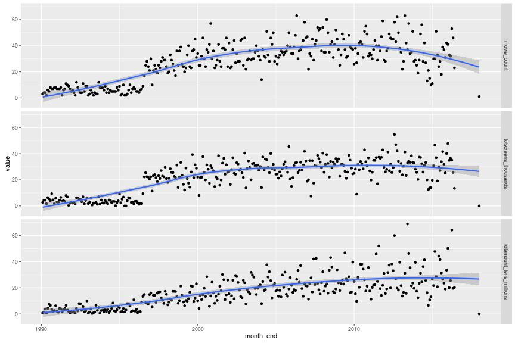

## Seasonality?

Is there a seasonality effect to revenue? First, let us look at the total gross
revenue _per screen_, as aggregated over a monthly basis. These numbers are in
tens of thousands of dollars. We see a slight increase in this number over
time, likely due to inflationary effects. (_i.e._ the price of a movie ticket
is simply increasing.) However, if we adjust for this baseline increase, we
should then see some seasonality.


```r
require(dplyr)
aggr <- openw %>% 
	filter(month_end > as.Date('1996-07-01')) %>%
	group_by(month_end) %>%
	summarize(movie_count=n(),
		totscreens_thousands=1e-3*sum(screens,na.rm=TRUE),
		totamount_tens_millions=1e-7*sum(amount,na.rm=TRUE)) %>%
	mutate(aps_tenk=totamount_tens_millions / totscreens_thousands) %>%
	filter(movie_count > 5)

ph <- ggplot(aggr,aes(x=month_end,y=aps_tenk)) + geom_point() + stat_smooth(method="lm")
print(ph)
```

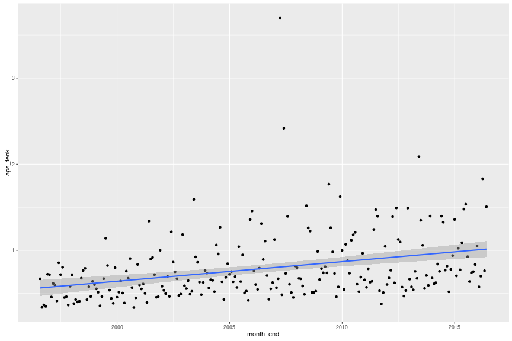

Now we remove that //linear// trend and look for non-linear and seasonality
effects. Below is the plot of gross receipts per screen over time.

```r
# normalize for linear trend
mod0 <- lm(aps_tenk ~ month_end,data=aggr)
aggr$residuals <- mod0$residuals

ph <- ggplot(aggr,aes(x=month_end,y=residuals)) + geom_point() + stat_smooth()
print(ph)
```

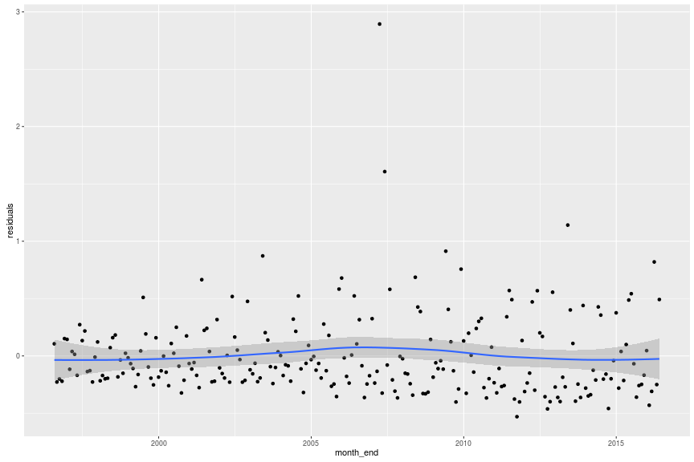

And here is the per-month receipts per screen, in tens of thousands of dollars,
with adjustments for (linear) inflation:

```r
aggr <- openw %>% 
	filter(month_end > as.Date('1996-07-01')) %>%
	group_by(month_end) %>%
	summarize(movie_count=n(),
		totscreens_thousands=1e-3*sum(screens,na.rm=TRUE),
		totamount_tens_millions=1e-7*sum(amount,na.rm=TRUE)) %>%
	mutate(aps_tenk=totamount_tens_millions / totscreens_thousands) %>%
	filter(movie_count > 5)
aggr$month <- factor(base::months(aggr$month_end,abbreviate=FALSE),levels=month.name)

# normalize for linear trend
mod0 <- lm(aps_tenk ~ month_end,data=aggr)
aggr$residuals <- mod0$residuals

ph <- ggplot(aggr,aes(x=month,y=residuals)) + geom_boxplot()
print(ph)
```

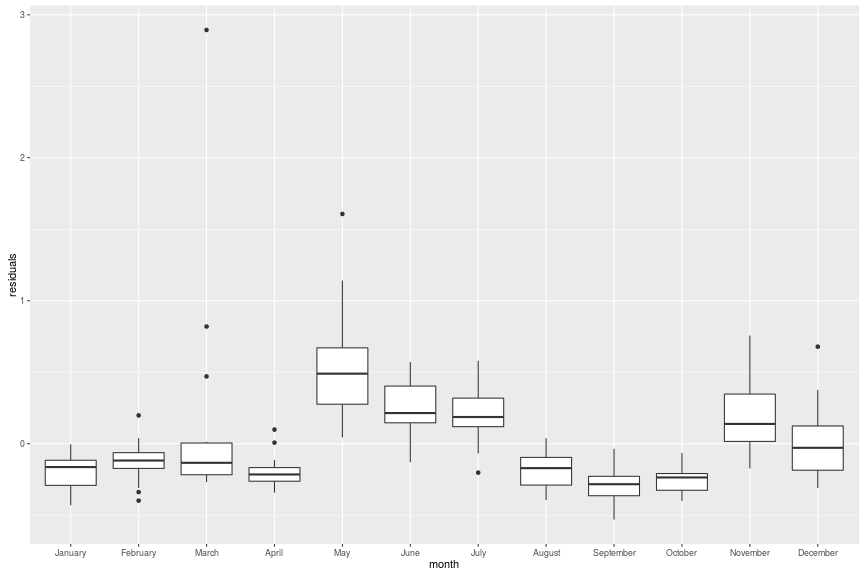

We can break this down even finer and aggregate by weeks, again removing the
linear trend, and then looking at boxplots. Because the labels are hard to read, I plot
again, removing the first part of the year.


```r
aggr <- openw %>% 
	group_by(week_end) %>%
	summarize(movie_count=n(),
		totscreens_thousands=1e-3*sum(screens,na.rm=TRUE),
		totamount_tens_millions=1e-7*sum(amount,na.rm=TRUE)) %>%
	mutate(aps_tenk=totamount_tens_millions / totscreens_thousands) %>%
	filter(week_end > as.Date('1996-07-01')) %>%
	filter(movie_count > 5) %>%
	filter(totscreens_thousands > 3)

ph <- ggplot(aggr,aes(x=week_end,y=aps_tenk)) + geom_point() + stat_smooth()
print(ph)
```

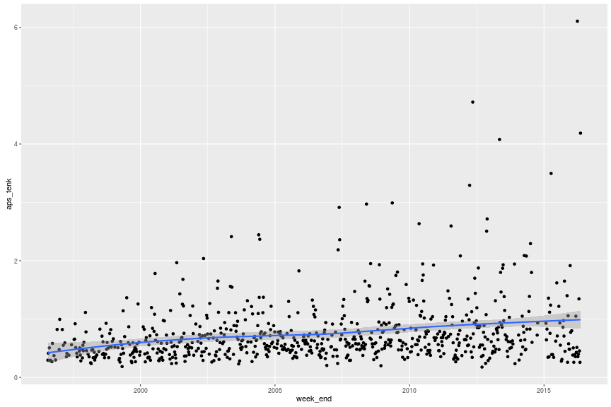

```r
# normalize for linear trend
mod0 <- lm(aps_tenk ~ week_end,data=aggr)
aggr$residuals <- mod0$residuals

aggr$yday <- lubridate::yday(aggr$week_end)
weekifier <- function(x) { as.Date(7 * ceiling((x-3)/7), origin=as.Date("1960-01-01")) }
aggr$week <- factor(as.character(weekifier(aggr$yday),format='%b %d'), 
	levels=as.character(sort(unique(weekifier(aggr$yday))),format='%b %d'),
	ordered=TRUE)

ph <- ggplot(aggr,aes(x=week,y=residuals)) + geom_boxplot()
print(ph)
```

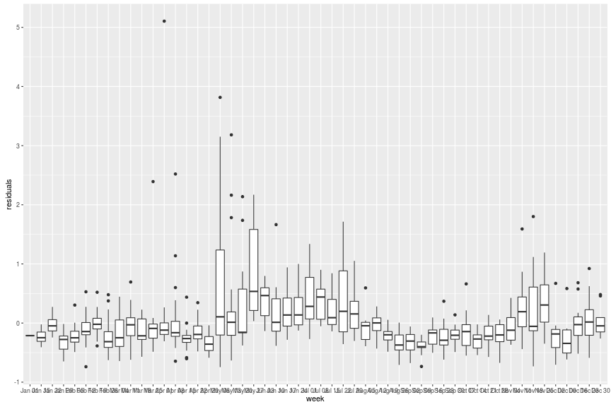

```r
# and the summer detail:
ph <- ggplot(aggr %>% filter(week > 'Apr 22') %>% filter(week < "Dec 09"),
	aes(x=week,y=residuals)) + geom_boxplot()
print(ph)
```

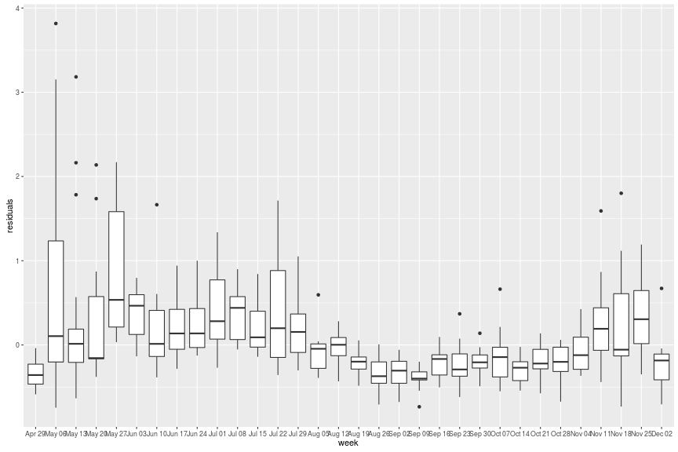

```r
# mental note: you should be able to make the plot larger!
# except: bitbucket + ggvis + knitr = fail
#aggr %>% ggvis(x=~week,y=~residuals) %>%
	#layer_boxplots()
```

## Does this hold for small films?

We see the classic 'summer blockbuster' effect starting in early May and running through July, with
another pickup in November. This effect is real and has to be corrected for if we are going to look at
studio films. One wonders if this effect persists for independent films. It appears there is a different 
seasonality effect. Here we grab the opening weekend gross receipts from films reporting to have shown at 
fewer 50 screens. (I suspect that some of these are due to bad data--sneak previews, fat finger errors, and
so on--but I have performed this analysis using a cap of $1M opening weekend as a filter, and have seen 
essentially the same pattern.)
Again, we compute the gross per screen, remove linear trend, then plot per month. There are two bumps here: 
one likely due to 'Oscar Season', where showcase films are presented at the end of the year, and then a bump 
in July and August. The latter, I would speculate, is due to movie-goers arriving at the theater to find they 
cannot get tickets to the big show, instead choosing the also-ran (or potentially sneak preview effect or bad
data).


```r
smal <- openw %>% 
	filter(month_end > as.Date('1996-07-01')) %>%
	filter(screens < 50) %>% 
	group_by(month_end) %>%
	summarize(movie_count=n(),
		totscreens_thousands=1e-3*sum(screens,na.rm=TRUE),
		totamount_tens_millions=1e-7*sum(amount,na.rm=TRUE)) %>%
	mutate(aps_tenk=totamount_tens_millions / totscreens_thousands) %>%
	filter(movie_count > 5) %>%
	filter(aps_tenk < 4)

# or cap at $1M opening gross. same ting.
#smal <- openw %>% 
	#filter(month_end > as.Date('1996-07-01')) %>%
	#filter(amount < 1e6) %>% 
	#group_by(month_end) %>%
	#summarize(movie_count=n(),
		#totscreens_thousands=1e-3*sum(screens,na.rm=TRUE),
		#totamount_tens_millions=1e-7*sum(amount,na.rm=TRUE)) %>%
	#mutate(aps_tenk=totamount_tens_millions / totscreens_thousands) %>%
	#filter(movie_count > 5) %>%
	#filter(aps_tenk < 4)

smal$month <- factor(base::months(smal$month_end,abbreviate=FALSE),levels=month.name)

# normalize for linear trend
mod0 <- lm(aps_tenk ~ month_end,data=smal)
smal$residuals <- mod0$residuals

ph <- ggplot(smal,aes(x=month,y=residuals)) + geom_boxplot()
print(ph)
```

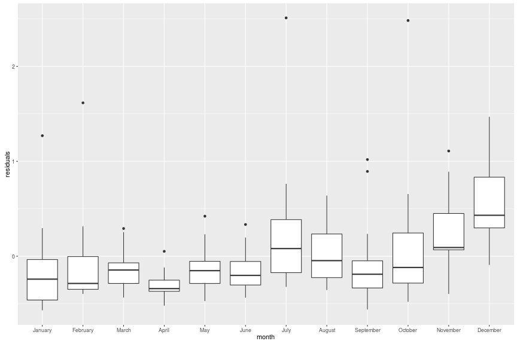

## All gross receipts

The IMDb data also holds weekend gross figures for films beyond their opening weekend.
Here I grab weekend gross numbers for films which opened on more than 100 screens. I
compute the gross receipts per screen, then normalize to opening weekend, 
then plot versus days since opening, with a single line per film. 
The y axis is in logscale, and since the opening weekend is _numeraire_, we expect to
(and do) see numbers smaller than one and decreasing over time.

I plot this again with a mean smooth and bands at the 0.25 and 0.75 quantiles. We see 
that at around 11 weeks after opening, the average film has gross receipts (per screen)
one tenth of opening weekend. We also see that the number of screens is steadily decreasing
after opening weekend.


```r
allg <- tbl(dbcon,'movie_weekend_gross') %>%
	filter(units == '$',locale=='USA') %>%
	mutate(aps=amount/screens) %>% 
	collect() 

firstw <- collect(allg) %>% 
	arrange(days_open) %>% 
	group_by(movie_id) %>%
	summarize(first_weekend=first(amount),
						first_aps=first(aps),
						first_screens=first(screens))

# interesting bimodal effect:
# hist(log10(1+firstw$first_weekend),50)

normalized <- left_join(collect(allg),firstw,by='movie_id') %>%
	mutate(prop_open=aps / first_aps) %>%
	filter(days_open < 200) %>%
	filter(first_screens > 100) %>% 
	filter(!is.na(prop_open)) %>% 
	mutate(weeks_open = ceiling(days_open / 7))

nquants <- normalized %>% 
	group_by(weeks_open) %>%
	summarize(q25=quantile(prop_open,0.25),
		q5=quantile(prop_open,0.5),
		q75=quantile(prop_open,0.75))


normalized <- left_join(normalized,nquants,by='weeks_open')

ph <- ggplot(normalized,aes(x=days_open,y=prop_open,group=movie_id,colour=screens)) + geom_line() + scale_y_log10()
print(ph)
```

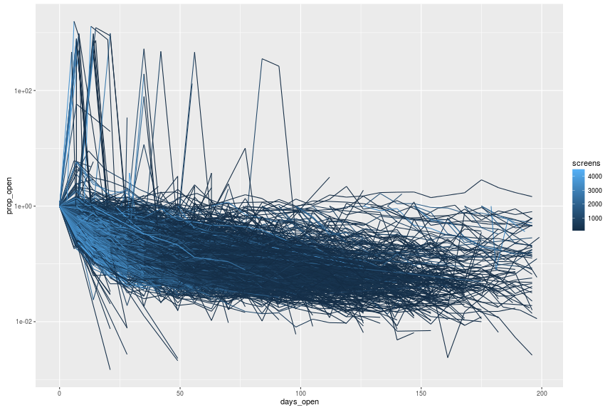

```r
ph <- ggplot(normalized,aes(x=weeks_open,y=prop_open)) + 
	stat_smooth() + 
	geom_point(aes(size=screens)) + 
	geom_ribbon(aes(x=weeks_open,ymin=q25,ymax=q75),alpha=0.5,fill='lightblue') + 
	scale_y_log10(limits=c(0.0001,10))
print(ph)
```

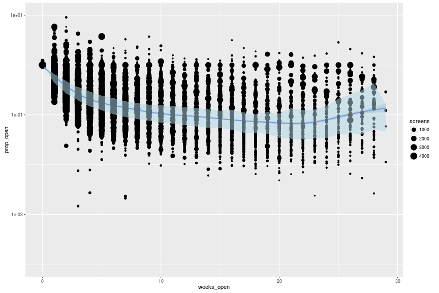

## Screens for budget

The IMDb data also holds budget data. Here we look at the number of screens reported for opening weekend
versus the reported budget, in millions, for films with US opens and budgets given in dollars. 
There seems to be two effects here: a somewhat linear effect for big studio productions, then a whole
bunch of sneak preview or limited release movies with somewhat random budgets. We cut out the latter in the 
second plot and capture the linear effect.


```r
budgets <- tbl(dbcon,'movie_budgets') %>%
	filter(units=='$') %>%
	select(-units,-id) %>%
	rename(budget=amount)
openw <- tbl(dbcon,'movie_opening_weekend') %>%
	filter(units == '$',locale=='USA') %>%
	select(-units,-locale,-id)
bcombo <- left_join(budgets,openw,by='movie_id') %>%
	filter(!is.na(screens)) %>% 
	mutate(budget_millions=1e-6*budget)

ph <- ggplot(bcombo %>% collect(),aes(x=budget_millions,y=screens)) + 
	geom_point() + 
	scale_x_log10() +
	scale_y_log10()
print(ph)
```

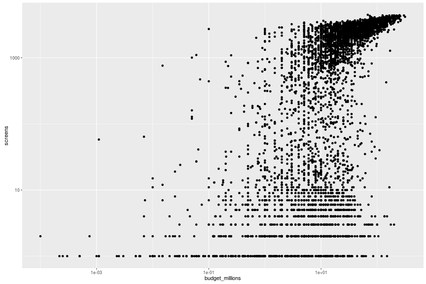

```r
ph <- ggplot(bcombo %>% filter(screens > 1000) %>% collect(),aes(x=budget_millions,y=screens)) + 
	geom_point() + 
	scale_x_log10() +
	scale_y_log10() +
	geom_smooth(method='lm')
print(ph)
```


This is only really 'linear' in a log plot. By performing linear regression in log space, we are actually 
capturing a [power law relationship](https://en.wikipedia.org/wiki/Power_law) between the two. This is a bit
odd because one would expect that screens (and, thereby, projected revenue) should scale _linearly_ with budget.
However, the fit we find is more like screens scale with budget to the 1/5th power. Part of this may be due
to oddities around our filtering of data, and some of this is due to the limited total number of theaters colliding
with the apparently unlimited budget of the studios. 


```r
mod0 <- lm(log(screens)~log(budget_millions),data=bcombo %>% filter(screens > 1000) %>% collect())
print(mod0$coefficients)
```

```
##          (Intercept) log(budget_millions) 
##               7.0751               0.2055
```

## By genre?

We have genre information in the IMDb data. Genres are not exclusive: a movie has multiple genres listed. To deal with
this problem, I compute the number of genres listed for a movie, then create a weighting for that movie which is
one over the total number of genres. Multiplying quantities by this weight then summing over all movies gives weighted
quantities on a per-genre basis. For example, we can compute the _weighted_ number of screens opening in a given weekend
for a given genre; when summing this quantity over genres, the total of should equal the sum of screens over all movies
because we defined the weights to sum to one over each movie.

Here I compute the weighted gross recipts on opening weekend, divided by the weighted total screens, aggregated over months,
then plotted for the most popular genres. There is not a huge difference between them, which feels a bit strange, although
`Action` movies appear to dominate slightly, with `Romance` showing the weakest returns.


```r
mgenres <- tbl(dbcon,sql("SELECT movie_id,info FROM movie_info WHERE info_type_id IN (SELECT info_type_id FROM info_type WHERE info='genres')")) %>%
	rename(genre=info)

totgenres <- mgenres %>%
	group_by(movie_id) %>%
	summarize(gcount=n()) %>%
	mutate(gweight=1/gcount) 

gentable <- left_join(mgenres,totgenres,by='movie_id')

# now join on opening weekend
openw <- tbl(dbcon,'movie_opening_weekend') %>%
	filter(units == '$',locale=='USA') %>%
	select(-units,-locale,-id)

openw <- left_join(openw,gentable,by='movie_id')

openw <- collect(openw) %>%
	mutate(end_date=as.Date(end_date)) %>%
	filter(end_date > as.Date('1996-01-01')) 

require(timeDate)
openw$week_end <- as.Date(timeDate::timeNdayOnOrAfter(as.timeDate(openw$end_date),nday=3))
openw$month_end <- as.Date(timeDate::timeLastDayInMonth(as.timeDate(openw$end_date)))

# now weight and group by genres
gopen <- openw %>% 
	mutate(wamount=amount * gweight,
				 wscreens=screens * gweight) %>%
	group_by(genre,month_end) %>%
	summarize(totfilms = n(),
						nfilms = sum(gweight,na.rm=TRUE),
						wtscreens_thousands=1e-3 * sum(wscreens,na.rm=TRUE),
						wamount_tenmillions=1e-7 * sum(wamount,na.rm=TRUE)) %>%
	filter(totfilms > 2) %>% 
	filter(wtscreens_thousands > 0.01) %>% 
	mutate(aps_tenk=wamount_tenmillions / wtscreens_thousands) %>%
	filter(!is.na(aps_tenk))

# select by popular genres
ngen <- gopen %>% 
	group_by(genre) %>% 
	summarize(count=n()) %>%
	filter(count > 200)

gopen <- gopen %>% 
	filter(genre %in% ngen$genre)

ph <- ggplot(gopen,aes(x=month_end,y=aps_tenk,group=genre,colour=genre)) +
	geom_point() +
	scale_y_log10() + 
	stat_smooth(method='loess')
print(ph)
```

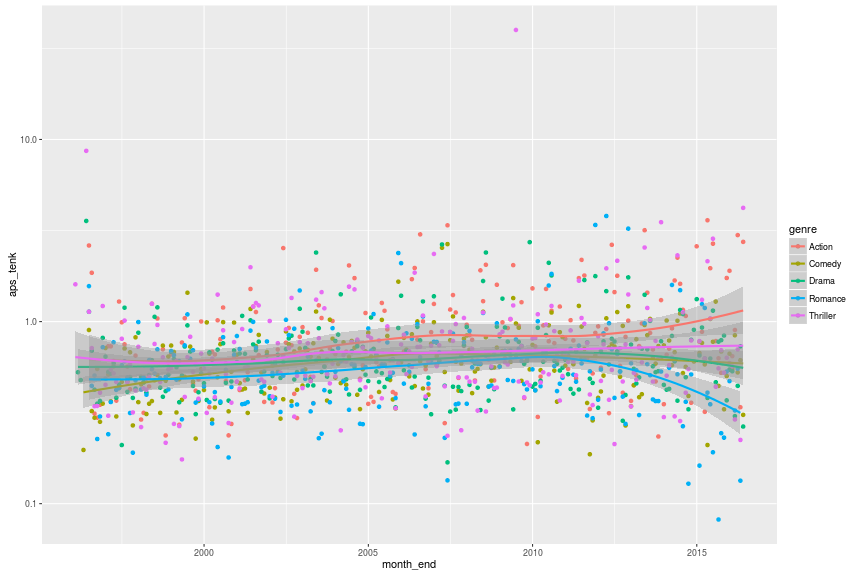

## Seasonality by genre?

Do we see the same seasonality patterns when breaking out by genre? Let us consider that.
First remove the linear trend, then boxplot the (weighted) gross per screen
against month with a strip for each genre. The numbers have been normalized geometrically
so the long term average is 1, and plotted in logscale.
There is a pronounced 'summer blockbuster' effect for `Action` and, to a lesser extent, for
`Comedy` and `Thriller`, but nothng of the sort for `Romance` and `Drama`, which tend to
have bumps in November.

The other way to view this, though typically frowned upon by statisticians, is via a stacked
bar chart. I compute one of those as well, giving the total proportion of gross receipts
attributed to each of five main genres, all normalized. The averaging might be a little funny
here (weighted by month, not by dollar), but I think the story will remain the same if we 
slice a different way: May is huge for `Action`, `Thriller`s perform well in September and into
October, and `Drama`s pick up later in the year. A case might also be had for `Romance` in February.


```r
mgenres <- tbl(dbcon,sql("SELECT movie_id,info FROM movie_info WHERE info_type_id IN (SELECT info_type_id FROM info_type WHERE info='genres')")) %>%
	rename(genre=info)

totgenres <- mgenres %>%
	group_by(movie_id) %>%
	summarize(gcount=n()) %>%
	mutate(gweight=1/gcount) 

gentable <- left_join(mgenres,totgenres,by='movie_id')

# now join on opening weekend
openw <- tbl(dbcon,'movie_opening_weekend') %>%
	filter(units == '$',locale=='USA') %>%
	select(-units,-locale,-id)

openw <- left_join(openw,gentable,by='movie_id')

openw <- collect(openw) %>%
	mutate(end_date=as.Date(end_date)) %>%
	filter(end_date > as.Date('1996-08-31')) 

require(timeDate)
openw$week_end <- as.Date(timeDate::timeNdayOnOrAfter(as.timeDate(openw$end_date),nday=3))
openw$month_end <- as.Date(timeDate::timeLastDayInMonth(as.timeDate(openw$end_date)))

# now weight and group by genres
gopen <- openw %>% 
	mutate(wamount=amount * gweight,
				 wscreens=screens * gweight) %>%
	group_by(genre,month_end) %>%
	summarize(totfilms = n(),
						nfilms = sum(gweight,na.rm=TRUE),
						wtscreens_thousands=1e-3 * sum(wscreens,na.rm=TRUE),
						wamount_tenmillions=1e-7 * sum(wamount,na.rm=TRUE)) %>%
	filter(totfilms > 2) %>% 
	filter(wtscreens_thousands > 0.01) %>% 
	mutate(aps_tenk=wamount_tenmillions / wtscreens_thousands) %>%
	filter(!is.na(aps_tenk))

# select by popular genres
ngen <- gopen %>% 
	group_by(genre) %>% 
	summarize(count=n()) %>%
	filter(count > 190)

gopen <- gopen %>% 
	filter(genre %in% ngen$genre)

gopen$month <- factor(base::months(gopen$month_end,abbreviate=FALSE),levels=month.name)

mod0 <- lm(log(aps_tenk) ~ month_end,data=gopen)
gopen$residuals <- exp(mod0$residuals)

ph <- ggplot(gopen,aes(x=month,y=residuals)) +
	geom_boxplot() + 
	facet_grid(genre ~ .) + 
	scale_y_log10(limits=c(0.1,10)) 
print(ph)
```

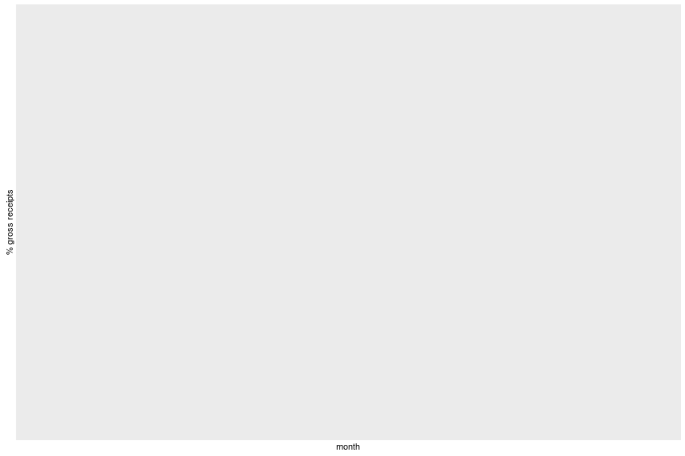

```r
moammt <- left_join(gopen,gopen %>% 
	group_by(month_end) %>%
	summarize(totwamount=sum(wamount_tenmillions,na.rm=TRUE)),
	by='month_end') %>%
	mutate(prop_amount=wamount_tenmillions / totwamount)


ph <- ggplot(moammt,aes(x=month,weight=100*prop_amount/19,fill=genre)) +
	geom_bar(binwidth=29) + 
	labs(y='% gross receipts')
print(ph)
```

```
## Error: StatBin requires a continuous x variable the x variable is discrete. Perhaps you want stat="count"?
```

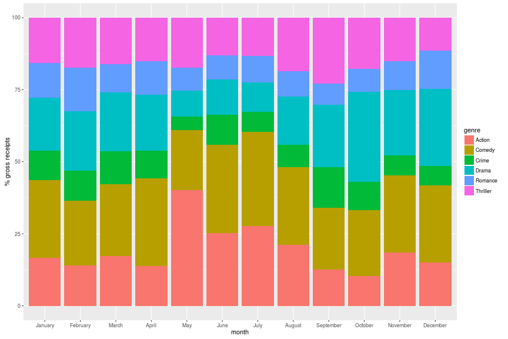


